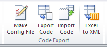
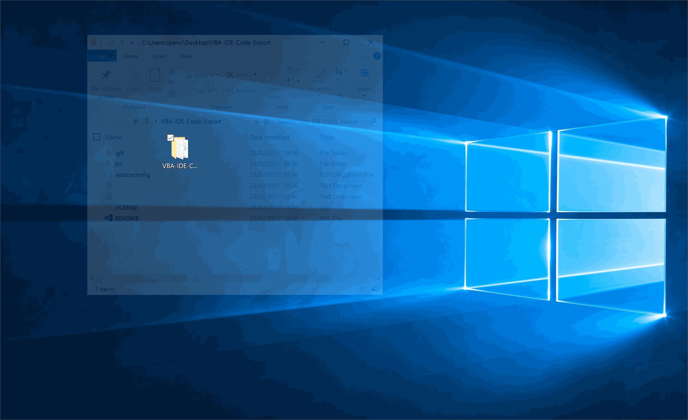

# VBA IDE CodeExport

[](http://opensource.org/licenses/MIT)  [](https://gitter.im/VBA-IDE-Code-Export)

[](http://isitmaintained.com/project/spences10/VBA-IDE-Code-Export "Average time to resolve an issue")  [](http://isitmaintained.com/project/spences10/VBA-IDE-Code-Export "Percentage of issues still open")

[](https://waffle.io/spences10/VBA-IDE-Code-Export) [](https://www.codetriage.com/spences10/vba-ide-code-export)

<!-- TOC -->

- [VBA IDE CodeExport](#vba-ide-codeexport)
  - [Intro](#intro)
  - [Installing](#installing)
  - [Usage](#usage)
    - [The configuration file](#the-configuration-file)
    - [Importing & Exporting](#importing--exporting)
  - [Build from source](#build-from-source)
    - [Clone the repo](#clone-the-repo)
    - [Build the binary](#build-the-binary)
    - [Add the code](#add-the-code)
  - [Contributing](#contributing)
  - [Roadmap](#roadmap)

<!-- /TOC -->

## Intro

Export your excel VBA project source code for use with Git (or any VCS) from the
Excel Developer ribbon, a pure VBA add-in for code export, no need to install a
COM add-in

Use this add-in so that all the associated VBA files used in a VBA project
(`*.cls`, `*.bas`, `*.frm` files) can be effortlessly exported for use with a
Version Control System.

Got code in your `Worksheet` and `ThisWorkbook` modules? No problem! CodeExport
takes care of those too, exporting them as `*.sht` and `*.wbk` files :+1:

This is specifically for Excel, although the VBIDE extensibility can be used for
all the MS Office suite.

## Installing

1. [Download](https://github.com/spences10/VBA-IDE-Code-Export/releases) the
   add-in installer (e.g. `CodeExport_setup_1.2.3.exe`)
2. Run the installer and follow the prompts.
3. In Excel, Check the `Trust access to the VBA project model` check box located
   in `Trust Centre -> Trust Centre Settings -> Macro Settings -> Trust access
   to the VBA project model`.

## Usage

After installing the add-in you will have the buttons for CodeExport in the
Excel Developer ribbon. The add-in will also create a menu in the VBA IDE (the
VBE) called `Export for VCS`. All controls for the add-in are found in these
menus.



### The configuration file

A file named `CodeExport.config.json` in the same directory as an Excel file
declares what gets imported into and exported from that Excel file. The `Make
Config File` button will create or update the configuration file automatically
based on the current contents of the active Excel file. The configuration file
can also be edited by hand in a text editor. This allows you to make further
adjustments that the `Make Config File` button cannot do.

The configuration file is a plain text file using the JSON file format. Here is
an example:

```JSON
{
    "VBAProject Name": "MyAwesomeProgram",
    "Base Path": "src",
    "Module Paths": {
        "Sheet1": "Sheet1.cls",
        "ThisWorkbook": "ThisWorkbook.cls",
        "Module1": "Module1.bas",
        "Class1": "my\\sub\\dir\\Class1.bas",
        "Userform1": "C:\\my\\absolute\\path\\Userform1.frx"
    },
    "References": [
		{
			"Name": "Scripting",
			"Description": "Microsoft Scripting Runtime",
			"GUID": "{420B2830-E718-11CF-893D-00A0C9054228}",
			"Major": 1,
			"Minor": 0
		}
    ]
}
```

Another example can be found in the
[comprehensive example project](test-projects/comprehensive).

Here is what each configuration property declares:

* `VBAProject Name` - The name of the VBAProject. Will be set on import. Must
  not contain any spaces.
* `Module Paths` - A file system path for every module that will be imported and
  exported by CodeExport. These may be relative or absolute paths.
* `Base Path` - A prefix to be prepended to all relative paths in
  `Module Paths`.
* `References` - A list of reference definitions. Each reference described will
  be referenced on import and dereferenced on export.

### Importing & Exporting

The `Import` button will:

* Import all the modules specified in the `Module Paths` configuration property.
  Existing modules in the Excel file will be overwritten.
* Add all library references declared in the `References` configuration
  property. Existing library references in the Excel file will be overwritten.
* Set the VBAProject name as declared in the `VBAProject Name` configuration
  property.

The `Export` button will:

* Export all the modules specified in the `Module Paths` configuration property.
  Existing files in the file system will be overwritten.
* Dereference libraries declared in the `References` configuration property.

## Build from source

### Clone the repo

Clone the repo `git clone https://github.com/spences10/VBA-IDE-Code-Export`,
navigate to where you have cloned the code to, there you will find the
`src/VBA-IDE-Code-Export.package` folder. This is the 'unpacked' version of the
VBA-IDE-Code-Export Excel `.xlsm` binary (workbook).

### Build the binary

To "repack" the binary, create an empty `.zip` file and name it
`VBA-IDE-Code-Export`. Open the empty `.zip` file then drag and drop the
**_contents_** of the `VBA-IDE-Code-Export.package` folder into the `.zip` file.

> Now [I'm assuming you're using Windows] if you have the Folder Options setting
for `Hide extensions for known file types` checked then this is the time to
uncheck it.



Rename the file extension on the newly created `VBA-IDE-Code-Export.zip` file
from `.zip` to `.xlsm`. Acknowledge the dialog saying `if you change the
extension bad things might happen` and you will have "packed" the binary, ready
to add the VBA code to.


### Add the code

The VBA code and related information can be imported using an already installed
copy of CodeExport, or it can be done manually.

All the necessary configuration for CodeExport to build itself is already
prepared in `src/CodeExport.config.json`. To perform the build:

1. Make sure you have a recent release of CodeExport installed. Instructions for
   installation can be found in the [Installing](#installing) section.
2. Open the `VBA-IDE-Code-Export.xlsm` template binary.
3. Use the CodeExport `Import` button to automatically import everything that is
   required. Since two versions of CodeExport is open at once, there will be two
   identical sets of buttons in the developer ribbon menu, and this can be
   confusing. Only one of these sets of buttons will work. If in doubt, use the
   menu available in the VBE, where there will only be one menu (for now).

If the automated method is not possible, everything can be done manually. The
best way to do this is to have the `VBA-IDE-Code-Export.xlsm` VBA IDE open in
one window then the file explorer open at the `src` folder in another window.

Multi select the contents of the folder **_excluding
`VBA-IDE-Code-Export.package` and `CodeExport.config.json`_** drag and drop into
the `VBA-IDE-Code-Export.xlsm` VBA IDE.

Add in the following references:

1. Microsoft Scripting Runtime
2. Microsoft Visual Basic for Applications Extensibility 5.3
3. Windows Script Host Object Model
4. Microsoft Shell Controls And Automation

Set the VBAProject name to `CodeExport`.

Save, Debug>Compile the project then from the Immediate pane in the VBA IDE
enter `auto_open` and hit return this should create the VBA IDE menu items,
you're ready to move onto **usage.**


### Build the installer

Instructions for building the installer (e.g. `CodeExport_setup_1.2.3.exe`) can
be found at
[doc/installer-build-instructions.md](doc/installer-build-instructions.md).

## Contributing

Please fork this repository and contribute back using GitHub pull requests.

Any contributions, large or small, major features, bugfixes, integration tests
and unit tests are welcomed and appreciated but will be thoroughly reviewed and
discussed.

## Roadmap

- [x] Add pretty ribbon UI
- [x] Export XL as XML
- [ ] Import XL from XML
- [ ] Command line interface
